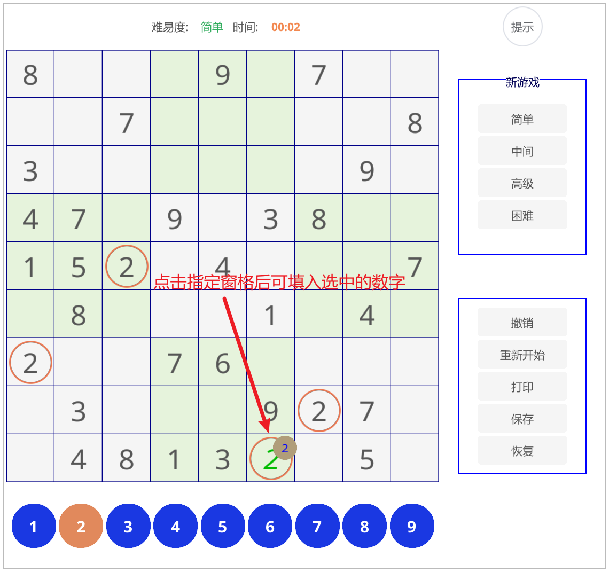
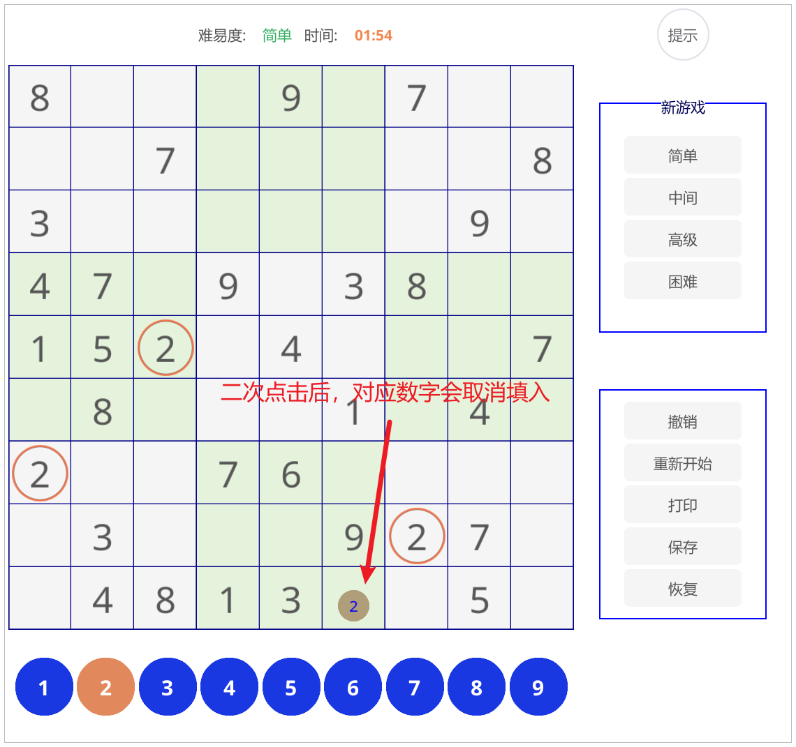
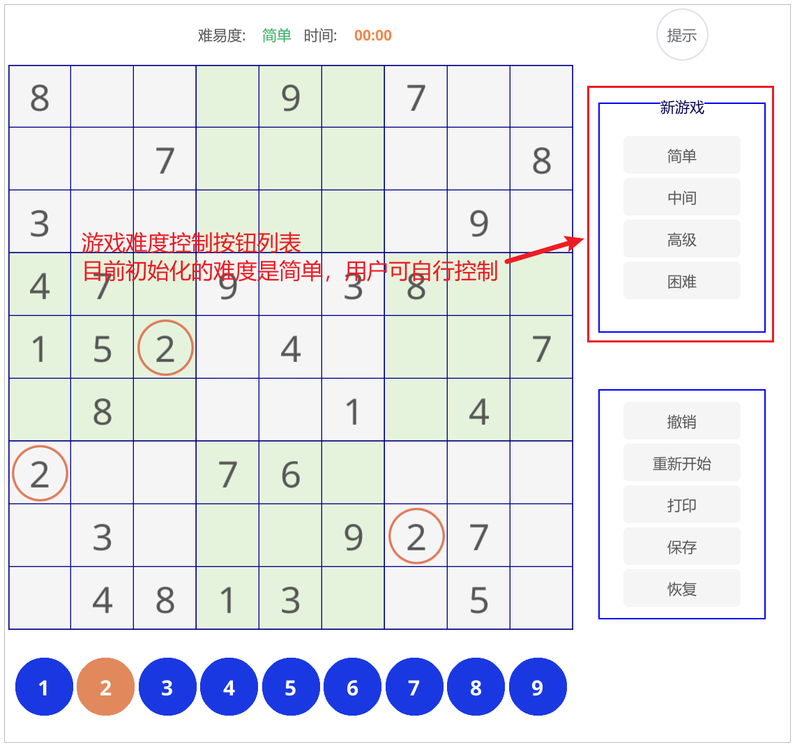
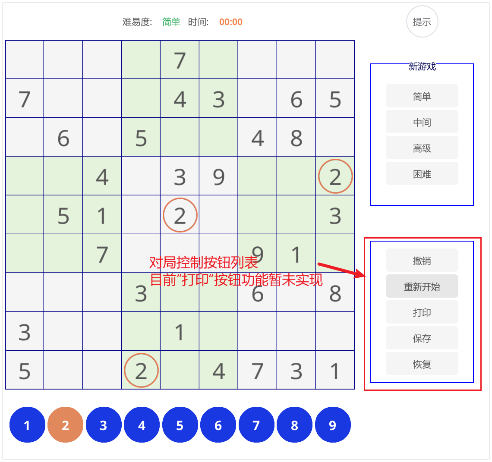
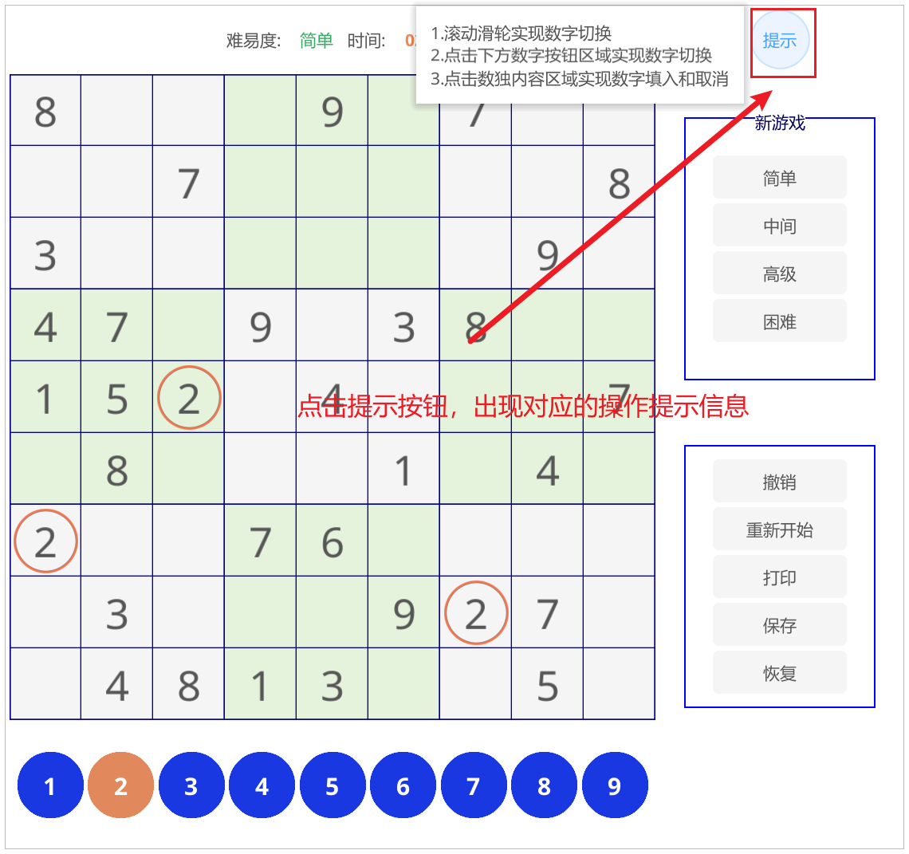
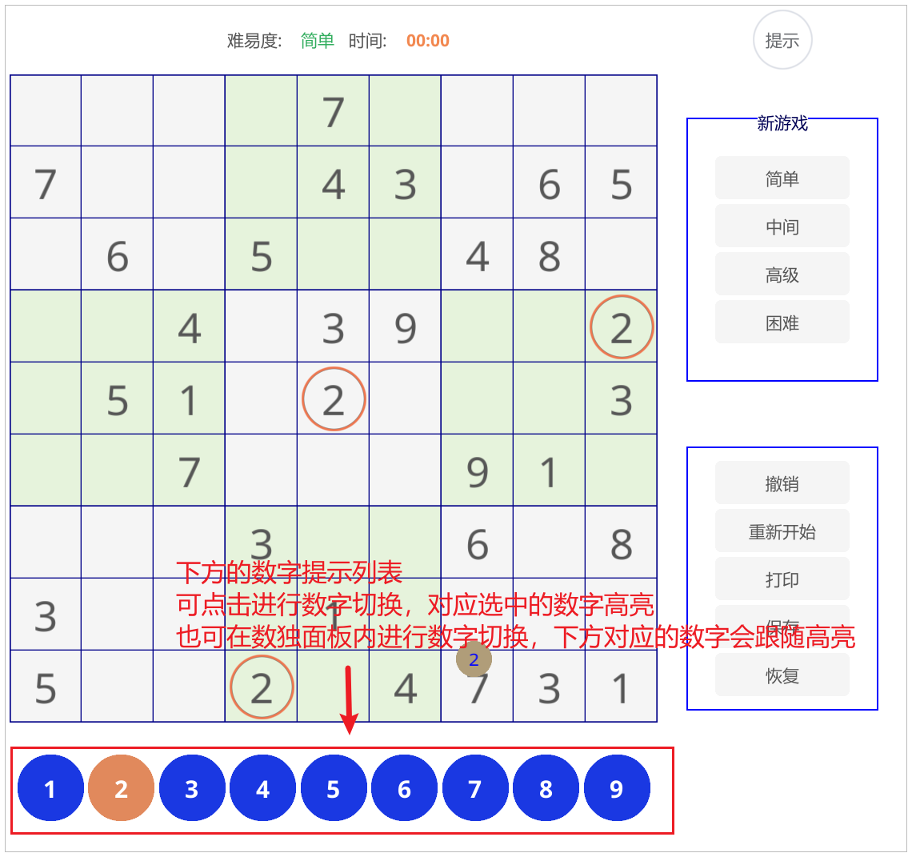
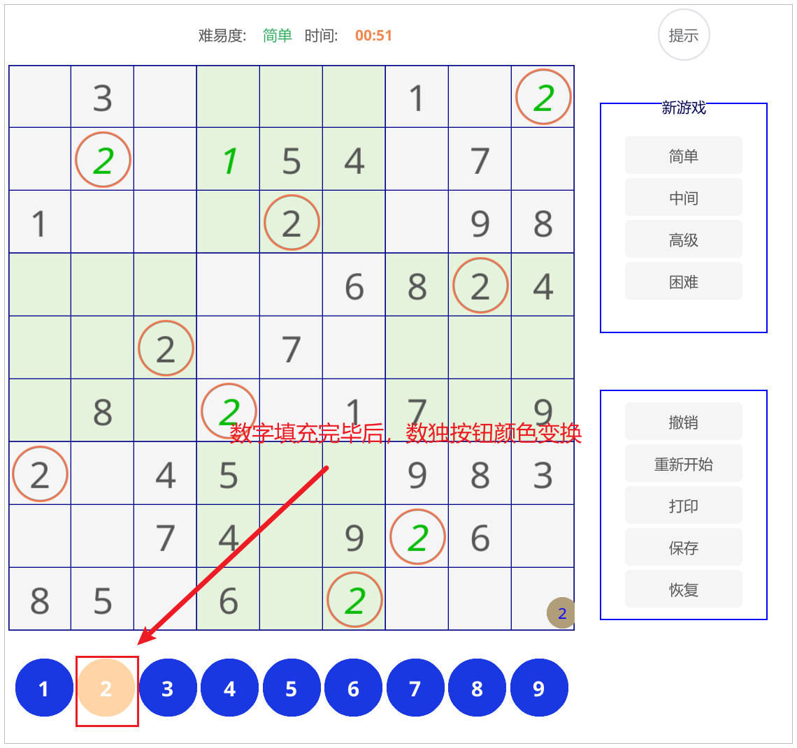

# Sudoku
## 概述：

基于fyne2.6的go语言编写的数独桌面程序

对应fyne官网地址：https://docs.fyne.io/

## 功能描述：

### 主体面板：

### 数独操作：

#### 1.数独填入

#### 2.数独取消

### 按钮列表：

#### 按钮列表-难度

#### 按钮列表-对局控制

#### 按钮-提示

### 数字列表：

#### 数字列表介绍

#### 数字列表-提示

